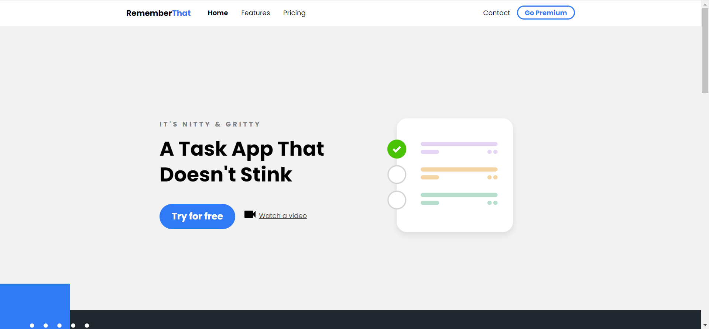

# static-ui-project

## Description
1. A responsive UI website home page based on HTML, CSS and a small amount of JavaScript. 
2. Native javascript realizes website homepage. 
3. Different typesetting styles will be generated according to the change of screen resolution.(based on @media) 

## 描述
1. 基于HTML、CSS和少量JavaScript的响应式UI网站主页。 
2. 原生javascript实现。 
3. 根据屏幕分辨率的变化，将应用不同的排版样式(基于@media)。 
## Pictures

